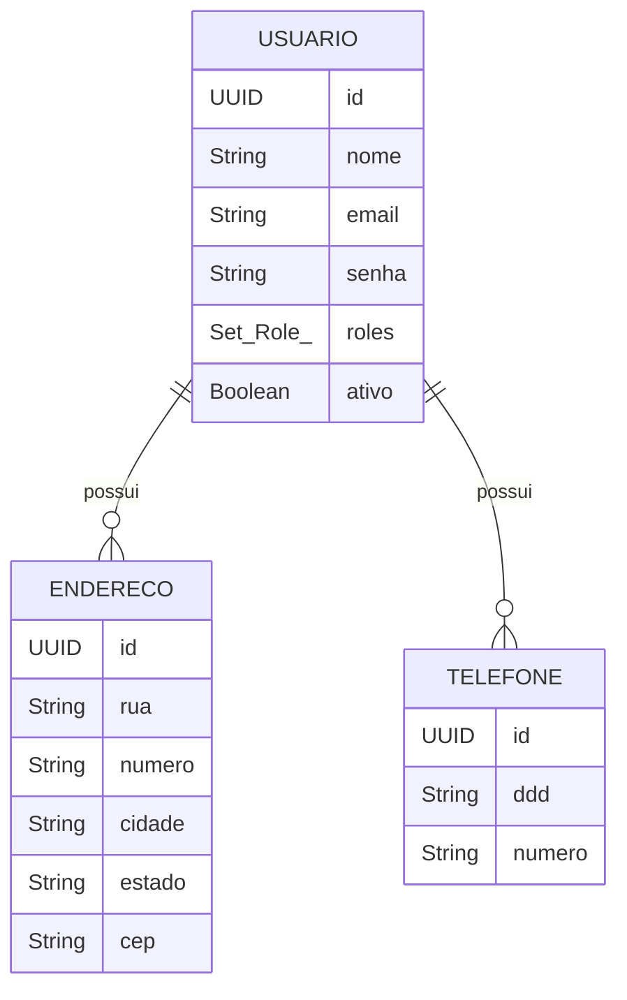

# API de Cadastro de Usuários

API robusta para gerenciamento de usuários, construída com Spring Boot, que oferece funcionalidades completas de CRUD, autenticação segura com JWT e gerenciamento de perfis.

[](https://www.java.com)
[](https://spring.io/projects/spring-boot)
[](https://gradle.org)
[](https://www.postgresql.org)
[](https://choosealicense.com/licenses/mit/)

## Visão Geral

Este projeto é uma API RESTful completa para cadastro e gerenciamento de usuários, seus endereços e telefones. A arquitetura foi projetada para ser segura, escalável e de fácil manutenção, utilizando tecnologias modernas do ecossistema Spring.

O foco principal é fornecer um sistema de autenticação seguro, utilizando JSON Web Tokens (JWT) com criptografia assimétrica (RSA), e um controle de acesso granular baseado em papéis (RBAC).

## Principais Funcionalidades

-   **Autenticação e Autorização:** Sistema completo de login, registro e renovação de token (refresh token) usando JWT.
-   **Segurança com Criptografia Assimétrica:** Geração de tokens JWT assinados com chaves RSA (RS256), garantindo que apenas o backend possa gerar tokens válidos.
-   **Controle de Acesso Baseado em Papéis (RBAC):** Endpoints protegidos com papéis `ADMIN` e `USUARIO`, utilizando as anotações `@PreAuthorize` do Spring Security.
-   **Gerenciamento de Usuários:** Operações de CRUD (Create, Read, Update, Delete) para usuários.
-   **Gerenciamento de Perfil:** Usuários autenticados podem visualizar e atualizar suas próprias informações, além de gerenciar seus endereços e telefones.
-   **Validação de Dados:** Validação completa das requisições na camada de Controller para garantir a integridade dos dados.
-   **Tratamento de Exceções Centralizado:** Respostas de erro padronizadas e consistentes através de um `GlobalExceptionHandler`.
-   **Documentação de API:** Documentação interativa e automatizada com SpringDoc (Swagger UI).
-   **Migrações de Banco de Dados:** Versionamento e gerenciamento do schema do banco de dados com Flyway.

## Tecnologias Utilizadas

-   **Backend:** Spring Boot 3.3.5
-   **Linguagem:** Java 21
-   **Segurança:** Spring Security, OAuth2 Resource Server (JWT)
-   **Banco de Dados:** Spring Data JPA, PostgreSQL
-   **Migrações:** Flyway
-   **Build Tool:** Gradle
-   **Documentação:** SpringDoc (OpenAPI 3 / Swagger)
-   **Utilitários:** Lombok

## Arquitetura e Conceitos Fundamentais

O projeto segue uma arquitetura em camadas bem definida, promovendo a separação de responsabilidades e a alta coesão.

### Modelo de Entidades

As entidades principais são `Usuario`, `Endereco` e `Telefone`. Um `Usuario` pode ter múltiplos endereços e telefones, caracterizando um relacionamento *One-to-Many*.



A entidade `Usuario` implementa a interface `UserDetails` do Spring Security, integrando-se diretamente ao contexto de segurança da aplicação.

### Arquitetura de Segurança

A segurança é um pilar deste projeto e foi implementada utilizando as melhores práticas do Spring Security.

**1. Autenticação com JWT e Criptografia Assimétrica (RSA)**

Diferente de abordagens que usam um segredo compartilhado (HMAC), esta API utiliza um par de chaves pública/privada (RSA).

-   **Chave Privada:** Mantida em segredo no servidor, é usada para **assinar** os JWTs (Access Token e Refresh Token). Isso garante a autenticidade do token.
-   **Chave Pública:** Pode ser distribuída e é usada para **verificar** a assinatura do token. A API se auto-valida usando a chave pública para garantir que os tokens recebidos não foram adulterados.

Este método oferece um nível de segurança superior, pois a capacidade de gerar tokens válidos é restrita exclusivamente ao detentor da chave privada.

**2. Fluxo de Autenticação**

1.  **Login (`/auth/login`):** O usuário envia `email` e `senha`.
2.  O `JwtAuthenticationService` valida as credenciais contra o banco de dados.
3.  Se as credenciais forem válidas, o `JwtTokenService` gera dois tokens:
    -   **Access Token:** Um JWT de curta duração (ex: 1 hora) com as permissões do usuário (`scope`). É usado para autorizar o acesso aos endpoints protegidos.
    -   **Refresh Token:** Um JWT de longa duração (ex: 7 dias) que pode ser usado para obter um novo Access Token sem que o usuário precise fazer login novamente.
4.  Ambos os tokens são retornados ao cliente.

**3. Acesso a Recursos Protegidos**

1.  O cliente faz uma requisição para um endpoint protegido (ex: `/usuarios/perfil`).
2.  O **Access Token** é enviado no cabeçalho `Authorization` como `Bearer <token>`.
3.  O `SecurityFilterChain` intercepta a requisição. O `JwtDecoder` (configurado com a chave pública RSA) valida a assinatura, a expiração e as claims do token.
4.  Se o token for válido, o Spring Security popula o `SecurityContext` com os dados do usuário e suas permissões (`authorities`).
5.  A anotação `@PreAuthorize` no controller verifica se o usuário possui a `scope` (`ADMIN` ou `USUARIO`) necessária para acessar o recurso.

**4. Renovação de Token (`/auth/refresh-token`)**

1.  Quando o Access Token expira, o cliente envia o **Refresh Token** para o endpoint `/auth/refresh-token`.
2.  O `JwtAuthenticationService` valida o Refresh Token.
3.  Se válido, um novo **Access Token** é gerado e retornado, enquanto o Refresh Token permanece o mesmo.

### Camada de Controller

-   **`JwtAuthController`:** Responsável pelos endpoints públicos de autenticação (`/login`, `/registro`, `/refresh-token`).
-   **`UsuarioController`:** Contém os endpoints protegidos para o gerenciamento de usuários e perfis. Utiliza o `SecurityContextHolder` para obter o email do usuário autenticado, garantindo que um usuário só possa modificar seus próprios dados (a menos que seja um `ADMIN`).

### Camada de Service

-   **`UsuarioService`:** Orquestra toda a lógica de negócio. É marcada como `@Transactional`, garantindo a atomicidade das operações com o banco de dados. Valida regras como a unicidade de emails antes de persistir os dados.
-   **`JwtAuthenticationService` e `JwtTokenService`:** Abstraem toda a complexidade da lógica de autenticação e geração de tokens.

### Mappers e DTOs

O projeto faz uso extensivo do padrão DTO (Data Transfer Object) para desacoplar as entidades da API externa.

-   **Requests (`/controllers/request`):** Objetos que representam os dados de entrada (ex: `RegistroUsuarioRequest`). Contêm anotações de validação.
-   **Responses (`/controllers/response`):** Objetos que representam os dados de saída (ex: `UsuarioResponse`), formatando os dados que serão enviados ao cliente.
-   **Mappers (`/mappers`):** Classes utilitárias (`@UtilityClass`) responsáveis por converter DTOs em Entidades e vice-versa. Isso mantém a lógica de conversão isolada e reutilizável.

## Endpoints da API

A documentação completa e interativa está disponível em `/swagger-ui.html`.

| Verbo  | Endpoint                | Descrição                               | Acesso          |
| :----- | :---------------------- | :-------------------------------------- | :-------------- |
| `POST` | `/auth/login`           | Autentica um usuário e retorna tokens.    | Público         |
| `POST` | `/auth/registro`        | Registra um novo usuário com o papel `USUARIO`. | Público         |
| `POST` | `/auth/refresh-token`   | Gera um novo Access Token a partir de um Refresh Token. | Público         |
| `GET`  | `/usuarios`             | Lista todos os usuários do sistema.       | `ADMIN`         |
| `POST` | `/usuarios/admin`       | Cria um novo usuário com o papel `ADMIN`. | `ADMIN`         |
| `DELETE`| `/usuarios/{id}`        | Deleta um usuário pelo seu ID.            | `ADMIN`         |
| `GET`  | `/usuarios/perfil`      | Retorna os dados do usuário autenticado.  | `USUARIO`, `ADMIN` |
| `PUT`  | `/usuarios/perfil`      | Atualiza os dados do usuário autenticado. | `USUARIO`, `ADMIN` |
| `POST` | `/usuarios/endereco`    | Cadastra um novo endereço para o usuário autenticado. | `USUARIO`, `ADMIN` |
| `POST` | `/usuarios/telefone`    | Cadastra um novo telefone para o usuário autenticado. | `USUARIO`, `ADMIN` |
| `PUT`  | `/usuarios/endereco/{id}`| Atualiza um endereço existente.           | `USUARIO`, `ADMIN` |
| `PUT`  | `/usuarios/telefone/{id}`| Atualiza um telefone existente.           | `USUARIO`, `ADMIN` |

## Como Executar o Projeto

### Pré-requisitos

-   JDK 21 ou superior
-   Gradle 8.8 ou superior
-   PostgreSQL
-   Um cliente de API (Postman, Insomnia, etc.)

### 1. Geração das Chaves RSA

Para a criptografia JWT, você precisa de um par de chaves pública/privada. Você pode gerá-las usando `openssl`:

```bash
# Gerar a chave privada
openssl genrsa -out private.pem 2048

# Extrair a chave pública da chave privada
openssl rsa -in private.pem -pubout -out public.pem
```

Coloque os arquivos `private.pem` e `public.pem` no diretório `src/main/resources/keys`.

### 2. Configuração do Banco de Dados

1.  Crie um banco de dados no PostgreSQL (ex: `usuarios_db`).
2.  Abra o arquivo `src/main/resources/application.yml`.
3.  Configure as propriedades do `datasource` com a URL do seu banco, usuário e senha.

```yaml
spring:
  datasource:
    url: jdbc:postgresql://localhost:5432/usuarios_db
    username: seu_usuario
    password: sua_senha
```

### 3. Execução da Aplicação

Utilize o Gradle Wrapper para executar a aplicação:

```bash
# No Windows
./gradlew bootRun

# No Linux/macOS
./gradlew bootRun
```

A API estará disponível em `http://localhost:8082`.

### 4. Acessando a Documentação

Após iniciar a aplicação, acesse a documentação interativa do Swagger UI em:
[http://localhost:8082/swagger-ui.html](http://localhost:8082/swagger-ui.html)


